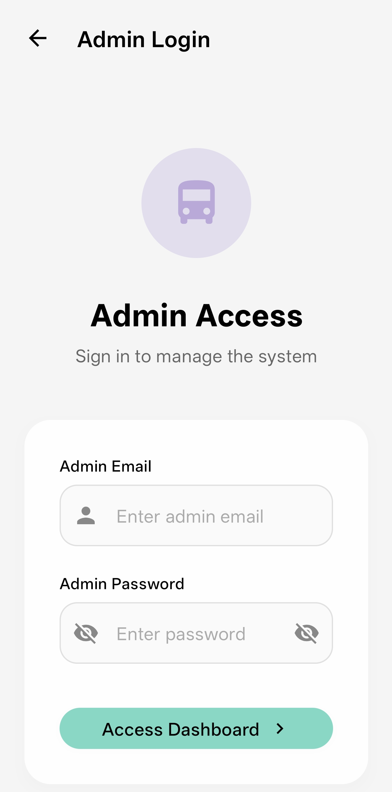
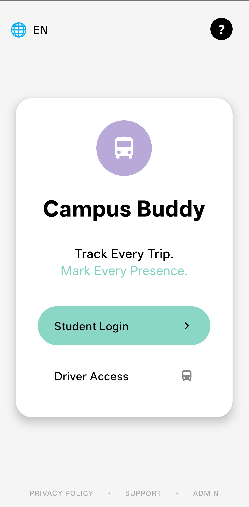

# 🚌 Campus Bus Buddy (Bus Alert System)

A smart mobile application designed to **digitalize college bus transportation** by combining **real-time bus tracking**, **QR-based attendance**, and **role-based system management**.  
The system ensures smooth coordination between **students, drivers, and administrators** using a secure cloud backend powered by Firebase.

---

## 🎯 Core Concept

Campus Bus Buddy aims to solve real-world campus transport problems by providing:

- Live bus location tracking  
- QR code–based boarding and attendance  
- Advance absence planning by students  
- Centralized admin monitoring  
- Secure, real-time data synchronization  

All without requiring any custom backend server.

---
## 📸 Screenshots

| Admin Login | Role Selection Screen |
|-------------|-----------------------|
|  |  |

---

## 🧩 System Roles & Purpose

### 👑 Admin Module

**Purpose:** Central system controller

Admin responsibilities:

- Manage buses, drivers, and students  
- Monitor total buses, drivers, and student counts  
- View attendance overview  
- Monitor live trips and system status  

Admin ensures the entire transport system runs smoothly.

---

### 🧑‍✈️ Driver Module

**Purpose:** Trip execution and attendance control

Driver responsibilities:

- Log in securely and access assigned bus  
- Start and manage trips  
- Display QR code for student boarding  
- Broadcast live bus location  
- View present students for each stop  

Drivers act as the operational backbone of the system.

---

### 🎓 Student Module

**Purpose:** Tracking, attendance, and alerts

Student capabilities:

- Scan QR code to mark boarding attendance  
- View live bus location on map  
- Mark absence for the next day in advance  
- Receive alerts when the bus reaches their stop  

Students get transparency and reliability in daily travel.

---

## 🔄 Application Workflow

1. User selects role (Student / Driver / Admin)  
2. Secure login via Firebase Authentication  
3. Role-based navigation is applied  
4. Real-time data sync through Firestore  
5. Live tracking and attendance updates occur instantly  

---

## 🛠 Tech Stack

- **Android (Kotlin)**  
- **Firebase Authentication**  
- **Firebase Firestore**  
- **Google Maps SDK & Location Services**  
- **CameraX & QR Code Scanning (ZXing / ML Kit)**  

---

## ✨ Key Features

- Role-based access (Admin, Driver, Student)  
- QR-based attendance system  
- Real-time bus tracking  
- Serverless cloud backend using Firebase  
- Modern, clean, glass-style UI design  
- Secure authentication and logout handling  

---

## 🚀 Future Improvements

- Complete UI for all modules  
- Full role-based authentication enforcement  
- Multi-bus and multi-route support  
- Push notifications for bus arrival alerts  
- Offline data handling and sync  
- ETA calculation and route optimization  
- Advanced admin analytics dashboard  

---

## 👨‍💻 Author

**Pandiharshan (Harshan)**  
Campus Bus Buddy – Smart Bus Attendance & Tracking System
