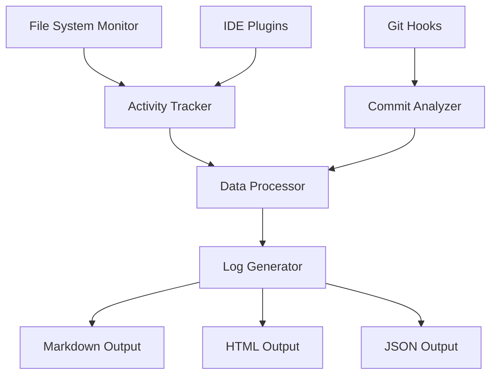

# Development Logging System Design

## Overview

The Development Logging System is a comprehensive solution for automatically tracking, analyzing, and documenting real development activities in the Snowman project. The system integrates with existing development tools to provide seamless activity monitoring without disrupting developer workflow.

## Architecture

The system follows a modular architecture with four main components:

1. **Activity Tracker**: Monitors file system changes and development activities
2. **Commit Analyzer**: Processes Git commits to extract meaningful development information
3. **Log Generator**: Formats and outputs development logs in various formats
4. **Integration Layer**: Provides seamless integration with development tools



## Components and Interfaces

### Activity Tracker
- **Purpose**: Monitor and record development activities in real-time
- **Interfaces**: 
  - File system watcher API
  - IDE plugin interface
  - Configuration management interface
- **Key Methods**:
  - `trackFileChange(filePath, changeType)`
  - `categorizeActivity(fileExtension, changeType)`
  - `recordSession(startTime, endTime, activities)`

### Commit Analyzer
- **Purpose**: Extract meaningful information from Git commits
- **Interfaces**:
  - Git hook integration
  - Commit message parsing API
  - Diff analysis interface
- **Key Methods**:
  - `analyzeCommit(commitHash)`
  - `extractWorkType(commitMessage, diffData)`
  - `categorizeChanges(fileChanges)`

### Log Generator
- **Purpose**: Format and output development logs
- **Interfaces**:
  - Template engine interface
  - Output format handlers
  - Data aggregation interface
- **Key Methods**:
  - `generateDailyLog(date, activities)`
  - `formatOutput(data, format)`
  - `aggregateStatistics(timeRange)`

### Integration Layer
- **Purpose**: Provide seamless tool integration
- **Interfaces**:
  - Git hook management
  - IDE plugin APIs
  - Configuration interfaces
- **Key Methods**:
  - `installGitHooks()`
  - `configureIDE(ideType)`
  - `exportToTool(toolFormat)`

## Data Models

### Activity Record
```javascript
{
  timestamp: Date,
  type: 'code_change' | 'commit' | 'test_run' | 'build',
  category: 'frontend' | 'backend' | 'styling' | 'testing' | 'documentation',
  files: [String],
  description: String,
  duration: Number,
  metadata: Object
}
```

### Daily Summary
```javascript
{
  date: Date,
  focus: String,
  workDone: [String],
  outcome: String,
  statistics: {
    totalTime: Number,
    categoriesWorked: [String],
    filesModified: Number,
    commitsCount: Number
  }
}
```

### Development Session
```javascript
{
  startTime: Date,
  endTime: Date,
  activities: [ActivityRecord],
  summary: String,
  productivity: Number
}
```

## Correctness Properties

*A property is a characteristic or behavior that should hold true across all valid executions of a system-essentially, a formal statement about what the system should do. Properties serve as the bridge between human-readable specifications and machine-verifiable correctness guarantees.*
**Property 1: Activity tracking completeness**
*For any* code change made during development, the Activity Tracker should record an activity record containing the correct timestamp, list of modified files, and change type classification.
**Validates: Requirements 1.1**

**Property 2: Commit analysis consistency**
*For any* Git commit with message and diff data, the Commit Analyzer should extract meaningful information about the development work performed, including work type and description.
**Validates: Requirements 1.2**

**Property 3: Activity categorization consistency**
*For any* development activity, the system should consistently categorize it into one of the defined types (feature, bugfix, refactor, documentation, testing) based on the activity characteristics.
**Validates: Requirements 1.3**

**Property 4: Session summarization completeness**
*For any* development session with recorded activities, the system should generate a meaningful summary that captures the work completed during that session.
**Validates: Requirements 1.4**

**Property 5: Chronological ordering preservation**
*For any* set of development activities with timestamps, the Log Generator should produce output where entries are ordered chronologically from earliest to latest.
**Validates: Requirements 2.1**

**Property 6: Log entry completeness**
*For any* day with development activities, the formatted log entry should include focus area, work completed list, and outcome description.
**Validates: Requirements 2.2**

**Property 7: Empty day filtering**
*For any* date range that includes days with no development activities, those empty days should be omitted from the generated log output.
**Validates: Requirements 2.3**

**Property 8: Multi-format output equivalence**
*For any* development log data, generating output in different formats (Markdown, HTML, JSON) should preserve the same essential information while maintaining format-specific structure.
**Validates: Requirements 2.4**

**Property 9: Work type detection consistency**
*For any* code change, the system should consistently detect the type of work (frontend, backend, styling, testing, documentation) based on file patterns and change characteristics.
**Validates: Requirements 3.1**

**Property 10: Description extraction meaningfulness**
*For any* commit with message and diff data, the system should extract a meaningful description that accurately represents the work performed.
**Validates: Requirements 3.2**

**Property 11: Time measurement accuracy**
*For any* tracked development activities, the measured time spent on different categories should accurately reflect the actual duration of work in each category.
**Validates: Requirements 3.3**

**Property 12: Statistical accuracy**
*For any* set of development activities, the generated statistics should accurately reflect the development patterns and productivity metrics present in the input data.
**Validates: Requirements 3.4**

**Property 13: Git integration reliability**
*For any* Git commit operation, the system's Git hooks should successfully capture and process the commit information without interfering with the commit process.
**Validates: Requirements 4.1**

**Property 14: Export format compatibility**
*For any* generated development log, the exported format should be compatible with and successfully importable into common project management tools.
**Validates: Requirements 4.3**

## Error Handling

The system implements comprehensive error handling across all components:

### Activity Tracker Errors
- **File System Access Errors**: Graceful degradation when file system monitoring fails
- **Permission Errors**: Proper handling of insufficient file access permissions
- **Resource Exhaustion**: Monitoring system resource usage and throttling when necessary

### Commit Analyzer Errors
- **Git Repository Errors**: Handling cases where Git repository is corrupted or inaccessible
- **Malformed Commit Data**: Robust parsing of incomplete or malformed commit information
- **Network Errors**: Handling remote repository access failures

### Log Generator Errors
- **Template Errors**: Fallback templates when primary templates fail to load
- **Output Format Errors**: Error recovery when specific output formats fail
- **Data Corruption**: Validation and recovery of corrupted activity data

### Integration Layer Errors
- **Hook Installation Failures**: Alternative integration methods when Git hooks cannot be installed
- **IDE Plugin Errors**: Graceful degradation when IDE plugins fail to load
- **Configuration Errors**: Default configuration fallbacks and validation

## Testing Strategy

The testing approach combines unit testing and property-based testing to ensure comprehensive coverage:

### Unit Testing Approach
- Test specific examples of activity tracking, commit analysis, and log generation
- Verify error handling scenarios with known problematic inputs
- Test integration points between components
- Validate configuration and setup procedures

### Property-Based Testing Approach
- Use **fast-check** library for JavaScript property-based testing
- Configure each property test to run a minimum of 100 iterations
- Generate random development activities, commits, and file changes for testing
- Verify universal properties hold across all generated inputs

**Property-based testing requirements:**
- Each property-based test must be tagged with a comment referencing the design document property
- Tag format: `**Feature: development-logging, Property {number}: {property_text}**`
- Each correctness property must be implemented by a single property-based test
- Tests must run without mocks to validate real functionality

### Test Data Generation
- **Activity Generators**: Create realistic development activities with various types and durations
- **Commit Generators**: Generate commits with diverse message formats and file changes
- **File Change Generators**: Simulate various types of code modifications
- **Time Series Generators**: Create realistic development session patterns

### Integration Testing
- Test Git hook installation and execution
- Verify IDE plugin functionality across different environments
- Test export compatibility with actual project management tools
- Validate performance impact on real development workflows